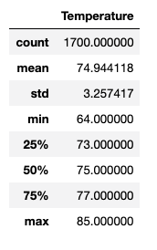
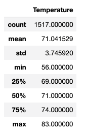

# Surfs Up

## Overview of the Analysis
W. Avy wanted more information about temperature trends before opening the surf shop. Specifically, he wanted temperature data for the months of June and December in Oahu, in order to determine if the surf and ice cream shop business is sustainable year-round.

We were tasked with determining the summary statistics for the monnth of December and June.

## Results
* June had an average temperature of 74.94 degress, whereas December had an average of 71.04 degrees.
* June had a maximum temperature of 85 degrees while Decemeber has a lower maximum temperature of 83 degrees.
* Temperature readings in December deviated a bit more (3.74) than in June (3.26)

## Summary
Our analysis provided us with a high level of summary of the diffecrences in temperature readings across the two months. June is little warmer than December. We also have more consistent readings in June compared to Decemeber, this is shown by the standard deviation in the analysis

It would be interesting to see analysis on rainfall as well as other condtions like cloudiness and windspeed in Oahu. Wind speed might be good for surfing but cloudiness not so much. This would help a lot with our decision.
